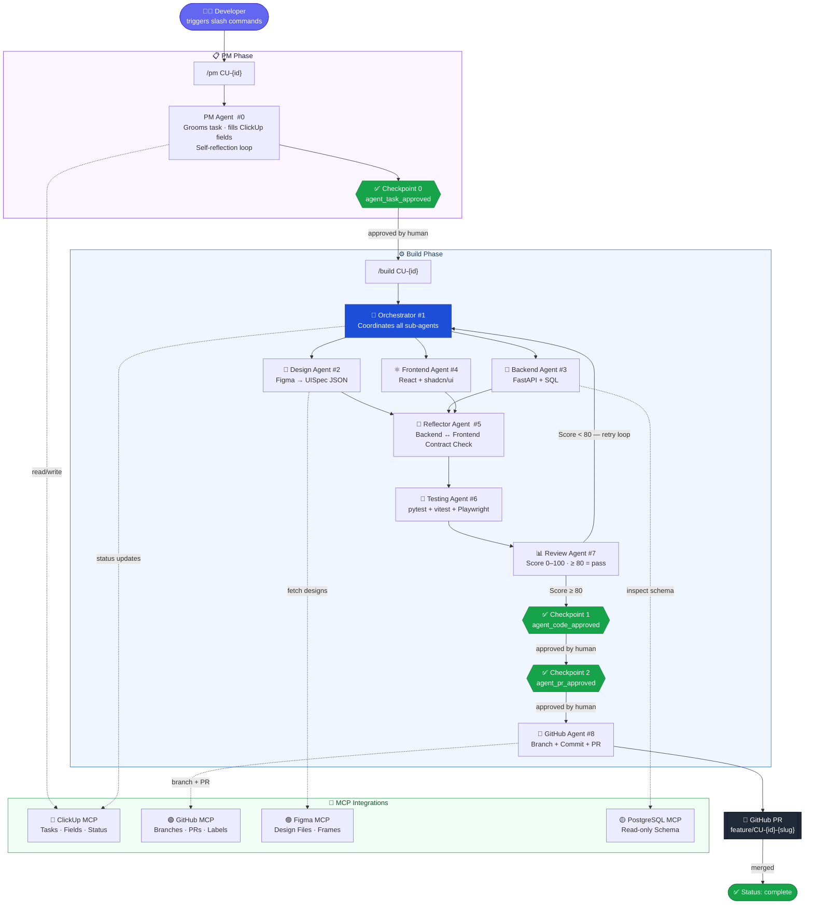
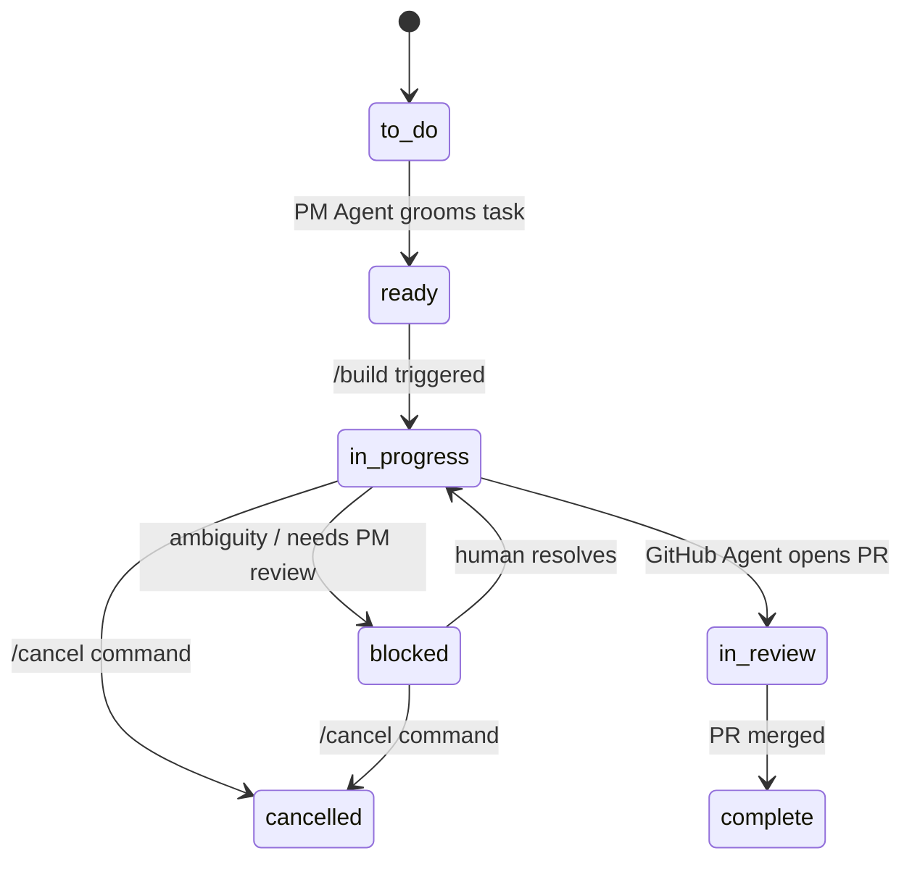

#  Agentic Dev Flow

> **Better way to view this:** GitHub renders Mermaid diagrams natively.
> Open this file on GitHub or in VS Code (with the Markdown Preview Mermaid Support extension) to see it rendered.
> For a static image, see [`agentic-flow.svg`](./agentic-flow.svg).

---

## Flow Diagram



---

## Mind Map

```mermaid
mindmap
  root((Vanta LMS\nAgentic Dev Flow))
    Developer Workflow
      /pm CU-{id}
      /build CU-{id}
      /status CU-{id}
      /retry CU-{id}
      /cancel CU-{id}
    Agents
      PM Agent #0
        Grooms ClickUp task
        Self-reflection loop
      Orchestrator #1
        Coordinates sub-agents
        Manages checkpoints
      Design Agent #2
        Reads Figma designs
        Outputs UISpec JSON
      Backend Agent #3
        FastAPI endpoints
        SQL migrations
      Frontend Agent #4
        React components
        shadcn/ui
      Reflector Agent #5
        Contract validation
        Backend ↔ Frontend
      Testing Agent #6
        pytest
        vitest
        Playwright
      Review Agent #7
        Score 0–100
        Pass threshold ≥ 80
      GitHub Agent #8
        Creates branch
        Commits code
        Opens PR
    Human Checkpoints
      CP0 agent_task_approved
      CP0.5 agent_requirements_approved
      CP1 agent_code_approved
      CP2 agent_pr_approved
    MCP Integrations
      ClickUp MCP
      GitHub MCP
      Figma MCP
      PostgreSQL MCP read-only
    Safety Guardrails
      bash_guard
      postgres_guard
      github_guard
      audit_logger
    Stack
      Backend FastAPI + PostgreSQL
      Frontend React + Tailwind + shadcn
      Monorepo Nx
      DB Neon PostgreSQL
```

---

## ClickUp Status Flow


